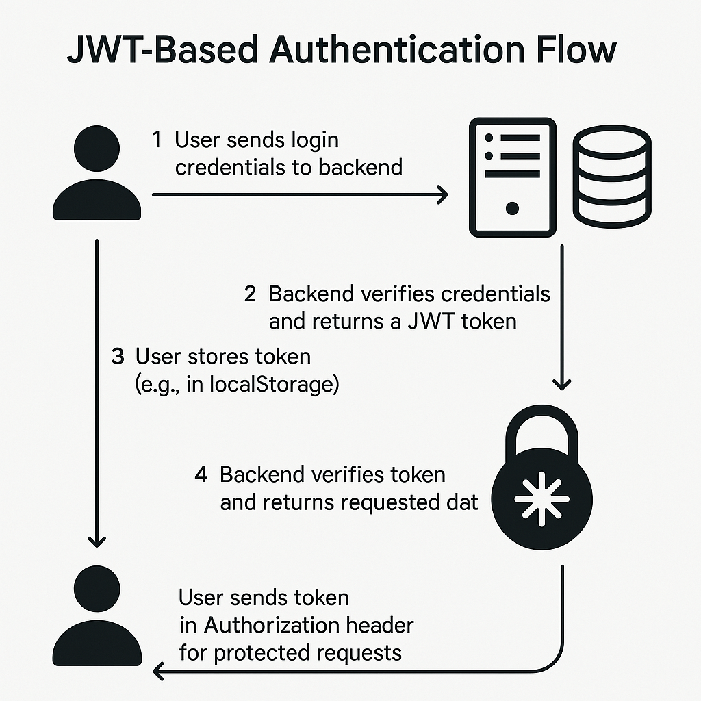
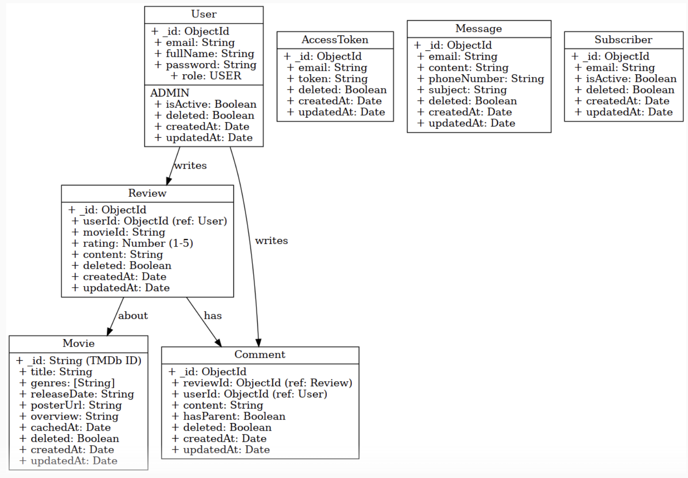

# Movie Review Web (MRW) App - Backend

This is the backend service for the Movie Review Web App. It is built with **Node.js** and **Express**, supports **JWT-based authentication**, integrates with the **TMDb API** for movie data, and allows users to discover and review movies with numeric ratings .


## Contributors


##  Features

-  User registration and login with JWT authentication
-  Movie discovery via external API (TMDb)
-  Submit and view ratings (1–5 stars)
-  Post and read user reviews
-  Secure password hashing with bcrypt
-  RESTful API endpoints

---

## Tech Stack

- **Node.js** + **Express**
- **MongoDB** with Mongoose
- **JWT** for authentication
- **MDb API** for movie data

## Project Structure
backend /

    ├── docs/ # Documentation folder - files and project related documents 
    ├── models/ # DB Models and Mongoose schemas 
    ├── routes/ # API route definitions 
    ├── middleware/ # Auth and error handling 
    ├── utils/ # Utils and other Helper functions 
    ├── config/ # DB and API config 
    └── app.js # Express app setup & entry point

## Authentication Flow


### User Roles Types
- **GUEST** - default non-registered user, with 'view-only' permissions
- **USER** - default registered user, with user-level read-write permissions
- **ADMIN** - super user, with elevetade roles

## Database Schema



## API Endpoints

#### Auth Endpoints

| Method | Endpoint             | Description                  | Auth Required |
|--------|----------------------|------------------------------|---------------|
| POST   | `/api/auth/register` | Register a new user          | ❌            |
| POST   | `/api/auth/login`    | Login and receive JWT token  | ❌            |
| GET    | `/api/auth/me`       | Get current user profile     | ✅            |

---

#### Movie Endpoints

| Method | Endpoint              | Description                        | Auth Required |
|--------|-----------------------|------------------------------------|---------------|
| GET    | `/api/movies/search`  | Search movies by title, genre, etc.| ❌            |
| GET    | `/api/movies/:id`     | Get movie details by TMDb ID       | ❌            |

> These endpoints act as a proxy to TMDb API and may include caching or enrichment logic.

---

#### Review & Rating Endpoints

| Method | Endpoint               | Description                          | Auth Required |
|--------|------------------------|--------------------------------------|---------------|
| POST   | `/api/reviews`         | Submit a review and rating           | ✅            |
| GET    | `/api/reviews/:movieId`| Get all reviews for a specific movie | ❌            |
| PUT    | `/api/reviews/:id`     | Edit a review                        | ✅ (owner)    |
| DELETE | `/api/reviews/:id`     | Delete a review                      | ✅ (owner)    |

---

#### User Management

| Method | Endpoint             | Description                  | Auth Required |
|--------|----------------------|------------------------------|---------------|
| GET    | `/api/users/:id`     | Get user profile by ID       | ✅            |
| GET    | `/api/users`         | List all users (admin only)  | ✅ (admin)    |

---

## Environment Variables

Create a `.env` file in the `backend/` directory with the following:
- PORT=changethis
- MONGO_URI=changethis
- JWT_SECRET=changethis
- MDB_API_KEY=changethis

## Running the App

#### 1. Clone the project repository

```bash
git clone git@github.com:gmaroko/mrw-backend.git backend
```

#### 2. Install dependencies

```bash
cd backend
npm install
```

#### 3. Start Development Server
```bash
npm run dev
```

The server will run on [Development Server](http://localhost:9467) | [Production Server](https://mrw-backend.onrender.com)


## License
This project is licensed under the [MIT License](./LICENSE). 